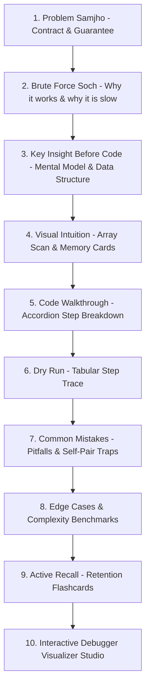

# 🚀 HumanFirstDSA: Enterprise SaaS & UI/UX Polish Master Blueprint

> **Purpose**: This specification document serves as the comprehensive design and architectural guide for transforming **HumanFirstDSA** into a tier-1, production-grade Enterprise SaaS platform (matching or exceeding the visual polish and product standards of *AlgoMaster.io*, *Refactoring.guru*, *ExecuteProgram*, and *Brilliant.org*). Any AI model or engineer reading this document should implement these guidelines step-by-step.

---

## 📑 Table of Contents
1. [Executive Summary & Core Objectives](#1-executive-summary--core-objectives)
2. [Design System & Theme Cohesion (Unified Dark-First Palette)](#2-design-system--theme-cohesion-unified-dark-first-palette)
3. [10-Step Pedagogical Architecture Standards](#3-10-step-pedagogical-architecture-standards)
4. [Interactive Debugger & Visualizer Engine Polish](#4-interactive-debugger--visualizer-engine-polish)
5. [Animation Physics & Micro-Interactions (Framer Motion FLIP)](#5-animation-physics--micro-interactions-framer-motion-flip)
6. [Navigation, Layout & Information Architecture](#6-navigation-layout--information-architecture)
7. [Enterprise SaaS Platform Features (Retention & Monetization)](#7-enterprise-saas-platform-features-retention--monetization)
8. [Mobile & Tablet Responsive UX Specifications](#8-mobile--tablet-responsive-ux-specifications)
9. [Actionable Implementation Checklist & Priority Matrix](#9-actionable-implementation-checklist--priority-matrix)

---

## 1. Executive Summary & Core Objectives

**HumanFirstDSA** possesses an industry-leading pedagogical model:
- 10-step structured problem walkthrough
- Conversational bilingual (Hinglish + English) mental model building
- "Sochne Ka Flow" (Inner monologue thought stream)
- Active recall interview prompts

### Key Objectives for Modernization:
1. **Eliminate the Theme Fracture**: Seamlessly integrate the currently split Light content and Dark debugger into a unified, premium dark-first or adaptive glassmorphic UI.
2. **Upgrade Visualizer to a Native-App Experience**: Integrate Framer Motion FLIP spring physics, stable upright pointers, and midpoint active-line code auto-scrolling.
3. **Enterprise SaaS Polish**: Add Table of Contents (TOC) jump rails, keyboard shortcuts, streak gamification, pattern roadmaps, and spaced repetition flashcards.

---

## 2. Design System & Theme Cohesion (Unified Dark-First Palette)

### 2.1 Core Color Palette & Design Tokens (Tailwind / CSS Variables)

```css
:root {
  /* Background Hierarchy */
  --bg-app: #05070e;           /* Deep space obsidian */
  --bg-surface: #0a0f1d;       /* Primary card surface */
  --bg-surface-elevated: #0f172a; /* Secondary elevated container */
  --bg-surface-glass: rgba(13, 17, 23, 0.75); /* Glassmorphism fill */

  /* Borders & Dividers */
  --border-subtle: #1e293b;     /* Slate 800 */
  --border-accent: rgba(56, 189, 248, 0.3); /* Sky 400 accent glow */

  /* Semantic Accents */
  --accent-emerald: #10b981;   /* Correct, match found, low/start pointer */
  --accent-sky: #0ea5e9;       /* Active focus, scanner pointer (mid) */
  --accent-purple: #a855f7;    /* Boundary wall, right/high pointer */
  --accent-amber: #f59e0b;     /* In-progress inspection, swap target */
  --accent-rose: #f43f5e;      /* Pitfalls, negative values, high region */

  /* Typography */
  --text-primary: #f8fafc;     /* Slate 50 */
  --text-secondary: #94a3b8;   /* Slate 400 */
  --text-muted: #64748b;       /* Slate 500 */
}
```

### 2.2 Layered Card Elevation & Glassmorphism Rules
- **Rule 1 (Card Styling)**: All problem cards must use `bg-[#0d1117]/90 border border-slate-800 rounded-2xl shadow-xl backdrop-blur-xl`.
- **Rule 2 (Subtle Ambient Glows)**: Section headers must incorporate radial background glows:
  ```html
  <div class="absolute inset-0 -z-10 bg-[radial-gradient(ellipse_at_top,_var(--tw-gradient-stops))] from-sky-500/10 via-transparent to-transparent pointer-events-none" />
  ```
- **Rule 3 (Active State Ring)**: Current active section / interactive card gets `ring-1 ring-sky-500/40 shadow-lg shadow-sky-500/5`.

---

## 3. 10-Step Pedagogical Architecture Standards

Every problem page must strictly maintain this 10-section narrative flow:



### Section Guidelines:
1. **Section 1: Problem Samjho**:
   - Split into `Target`, `Contract`, `Output Rule`, and `Guarantee` badges.
2. **Section 2: Brute Force Soch**:
   - Include comparison table with $n=5, 100, 1000$ to visceralize $O(N^2)$ inefficiency.
3. **Section 3: Key Insight Before Code**:
   - Provide the **"Memory Sawaal"** (e.g. *"Kya target - nums[i] pehle dekha hai?"*).
4. **Section 4: Visual Intuition**:
   - Color-coded array cards (Emerald = Stored, Sky = Current, Slate = Future).
5. **Section 5: Code Walkthrough**:
   - Shiki Tokyo-Night code block with line-by-line expandable accordion.
6. **Section 6: Dry Run**:
   - Trace table with step index, current value, complement, memory state before, and action.
7. **Section 7: Common Mistakes**:
   - Red callout boxes (`bg-rose-500/10 border-rose-500/30`) for typical interview bugs.
8. **Section 8: Edge Cases & Complexity**:
   - Empty input, single element, duplicates, negative numbers.
9. **Section 9: Active Recall**:
   - Interactive flip cards for interview conceptual questions.
10. **Section 10: Interactive Debugger Visualizer**:
    - Full-featured IDE code runner + 2D canvas simulation.

---

## 4. Interactive Debugger & Visualizer Engine Polish

```
┌────────────────────────────────────────────────────────────────────────────────────────┐
│  ⚡ INTERACTIVE CODE RUNNER & TRACE STUDIO                                 [ 1x ] [ ▶ ] │
├──────────────────────────────────────┬─────────────────────────────────────────────────┤
│  // Shiki Tokyo-Night Editor         │  Interactive Array & Hash Map Memory Canvas     │
│  1  function twoSum(nums, target) {  │                                                 │
│  2    const seen = new Map();        │  nums:  [ 2 ]   [ 7 ]   [ 11 ]   [ 15 ]         │
│▶ 3    for (let i = 0; i < n; i++)    │           ▲       ▲                             │
│  4      const comp = target - num;   │         [seen]  [i=1]                           │
│  5      if (seen.has(comp)) ...      ├─────────────────────────────────────────────────┤
│                                      │  🧠 Hash Map Memory: { 2 -> index 0 }           │
│                                      │  💬 "Complement 2 found in Map! Returning [0,1]"│
└──────────────────────────────────────┴─────────────────────────────────────────────────┘
```

### 4.1 Code Runner Line Auto-Centering
- When stepping through the algorithm, the highlighted execution line must smoothly center within the code container:
  ```typescript
  const targetOffset = activeElement.offsetTop - container.clientHeight / 2 + activeElement.clientHeight / 2;
  container.scrollTo({ top: Math.max(0, targetOffset), behavior: 'smooth' });
  ```

### 4.2 Real-Time Memory Visualizer
- Rather than rendering plain JSON `{ 2: 0 }`, render interactive **Hash Buckets / Key-Value Badges**:
  - Key: `2` (Pill badge) $\rightarrow$ Value: `index 0` (Emerald badge)
  - Animated entrance: `initial={{ scale: 0.8, opacity: 0 }} animate={{ scale: 1, opacity: 1 }}`

### 4.3 Interactive Timeline Scrubber
- Add an interactive slider allowing the user to drag across the entire execution timeline (Step $1$ to $M$) with real-time state preview on hover.

---

## 5. Animation Physics & Micro-Interactions (Framer Motion FLIP)

### 5.1 Reusable Array & Pointer Component Standard
- Always use physical FLIP layout animations with `motion.div` and `layout`:
  ```tsx
  <motion.div
    layout
    transition={{ type: 'spring', stiffness: 350, damping: 25 }}
    className="relative rounded-2xl border-2 ..."
  >
    {/* Stable Upright Pointer Badges */}
    <div className="absolute -bottom-8 flex flex-col items-center">
      <span className="bg-sky-400 text-slate-950 text-[10px] font-black px-1.5 py-0.5 rounded shadow">
        i={idx}
      </span>
    </div>
  </motion.div>
  ```

### 5.2 Two-Phase Swap / Pointer Motion Pattern
- **Phase 1**: Array blocks physically translate across the rail while pointers stay stationary.
- **Phase 2**: Pointer badges smoothly glide to their new index positions once block repositioning completes.

### 5.3 Solution Match Ripple Effect
- When target criteria is met (e.g. complement matched or subarray sum found):
  - Trigger an emerald glow pulse (`ring-4 ring-emerald-400/80 animate-pulse`).
  - Render an animated confetti / droplet burst.

---

## 6. Navigation, Layout & Information Architecture

### 6.1 Sticky Floating Table of Contents (TOC Rail)
On desktop viewports ($\ge 1280\text{px}$), render a persistent right-side or left-side navigation rail:
- `01. Problem Samjho`
- `02. Brute Force Soch`
- `03. Key Insight`
- `04. Visual Intuition`
- `05. Code Walkthrough`
- `06. Dry Run Trace`
- `07. Common Mistakes`
- `08. Edge Cases`
- `09. Active Recall`
- `10. Visualizer Studio`

Active link highlights dynamically using `IntersectionObserver`.

### 6.2 Pro Keyboard Shortcuts
Enable global hotkeys when visualizer is focused:
- `Space`: Play / Pause auto-simulation
- `ArrowRight` / `L`: Step Forward
- `ArrowLeft` / `J`: Step Backward
- `R`: Reset to Step 1
- `F`: Toggle Full-Width Studio Mode

---

## 7. Enterprise SaaS Platform Features (Retention & Monetization)

```
┌─────────────────────────────────────────────────────────────────────────────┐
│ 👤 User Progress: 18 / 75 Solved  🔥 7-Day Streak  ⭐ 450 Mastery XP        │
├─────────────────────────────────────────────────────────────────────────────┤
│ 🏷️ Patterns Tracked:  [ Two Pointers 8/12 ]  [ Sliding Window 5/8 ]         │
│ 🎯 Next Recommended:  LeetCode 15: 3Sum (Follow-up to Two Sum)              │
│ 💾 Bookmark Lesson    📝 Personal Notes    📤 Share Interactive Trace       │
└─────────────────────────────────────────────────────────────────────────────┘
```

1. **Pattern Mastery Roadmap & Progress Tracker**:
   - Organize problems into patterns: *Two Pointers*, *Sliding Window*, *Prefix Sum*, *Binary Search*, *Monotonic Stack*, *Tree Traversal*.
   - Show pattern completion percentage and next recommended problem.
2. **Interactive Flashcard Spaced Repetition (SRS)**:
   - Convert Section 9 into interactive 3D flip flashcards with interval scheduling (`Again`, `Good`, `Easy`).
3. **Shareable Interactive Step URLs**:
   - Query parameter sync: `?step=4&preset=custom&speed=1x` allowing users and educators to share exact debugger states.
4. **Personal Notes & In-Browser Solution Playground**:
   - Sticky markdown notepad for user interview notes saved to `localStorage` or cloud database.

---

## 8. Mobile & Tablet Responsive UX Specifications

1. **Mobile Segmented Tabs**:
   - On mobile screens ($< 768\text{px}$), provide a sticky top tab switcher:
     `[ Theory & Intuition ]` | `[ Dry Run ]` | `[ Visualizer ]`
2. **Touch Swipe Gestures**:
   - Swipe Left on Canvas $\rightarrow$ Step Forward.
   - Swipe Right on Canvas $\rightarrow$ Step Backward.
3. **Collapsible Guide Mode**:
   - Support `Collapse Guide` toggle to maximize vertical screen space for the visualizer on smaller laptops.

---

## 9. Actionable Implementation Checklist & Priority Matrix

| Phase | Task | Impact | File / Component Targets |
| :--- | :--- | :---: | :--- |
| **P0 (Immediate)** | Unify dark theme palette across all 10 sections | 🌟 High | Global CSS, `app/layout.tsx`, Page root containers |
| **P0 (Immediate)** | Implement Sticky Floating TOC navigation rail | 🌟 High | `components/common/TableOfContentsRail.tsx` |
| **P0 (Immediate)** | Add Previous Step (`SkipBack`) and Keyboard Shortcuts | 🌟 High | Visualizer control decks, page event listeners |
| **P1 (Core UX)** | Add Shiki Code Runner Line Auto-Centering Engine | ⚡ Medium | `components/common/CodeRunner.tsx` |
| **P1 (Core UX)** | Integrate Framer Motion FLIP Spring Pointers | ⚡ Medium | `components/common/ReorderableArrayRail.tsx` |
| **P1 (Core UX)** | Build Key-Value Memory Hash Map Bucket visualizer | ⚡ Medium | Visualizer Canvas components |
| **P2 (SaaS Growth)** | Implement Pattern Mastery Graph & Streak Tracker | 🚀 High | `app/tracker/page.tsx`, `lib/trackerData.ts` |
| **P2 (SaaS Growth)** | Add Spaced Repetition Flip Flashcards on Section 9 | 🚀 High | `components/common/ActiveRecallCards.tsx` |
| **P2 (SaaS Growth)** | Enable Shareable Step URLs (`?step=X`) | 🚀 Medium | Next.js `useSearchParams` hook |

---

*Authored for the Antigravity Autonomous Engineering Agent & HumanFirstDSA Team.*
